# Professional Mermaid Diagrams Showcase - Production Quality

High-quality, professionally designed Mermaid diagrams with consistent proportions, proper spacing, and aesthetic excellence.

---

## 1. System Architecture Diagrams

### Example 1.1: Event-Driven Microservices Architecture
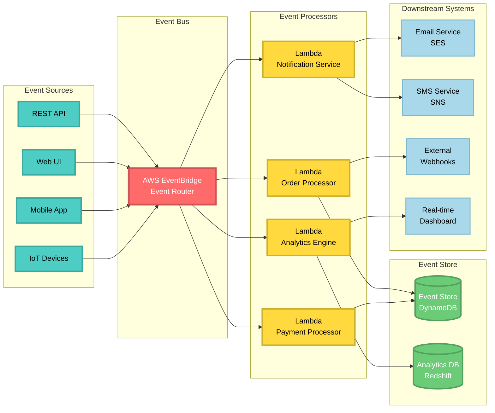

### Example 1.2: Three-Tier Web Application Architecture
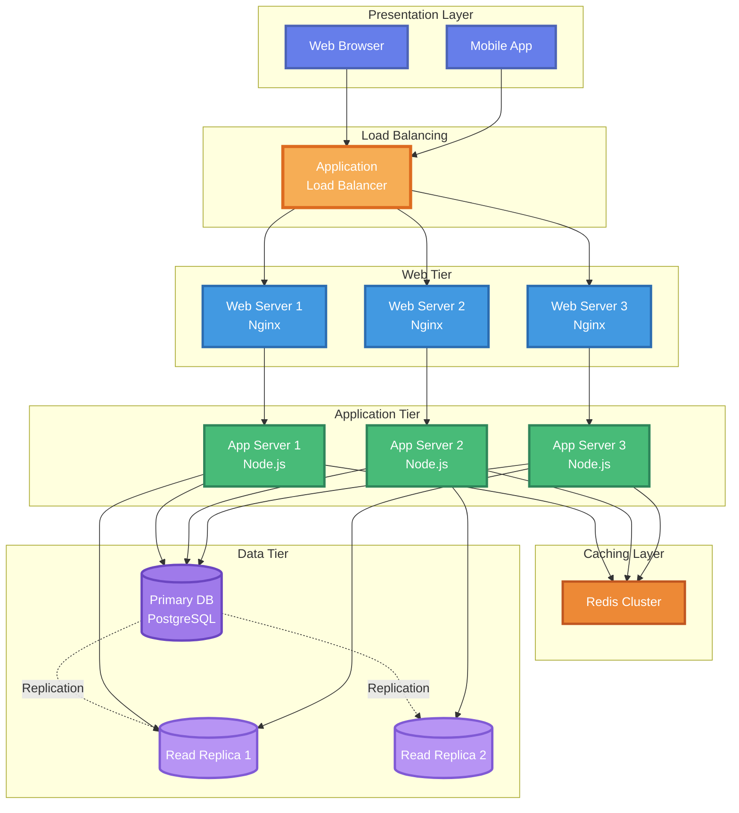

### Example 1.3: Kubernetes Cluster Architecture
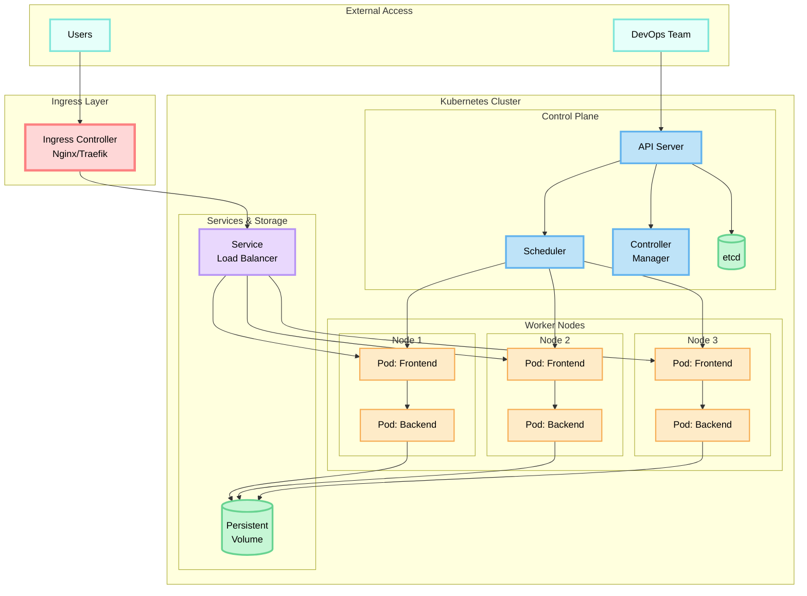

---

## 2. Sequence Diagrams

### Example 2.1: User Authentication Flow
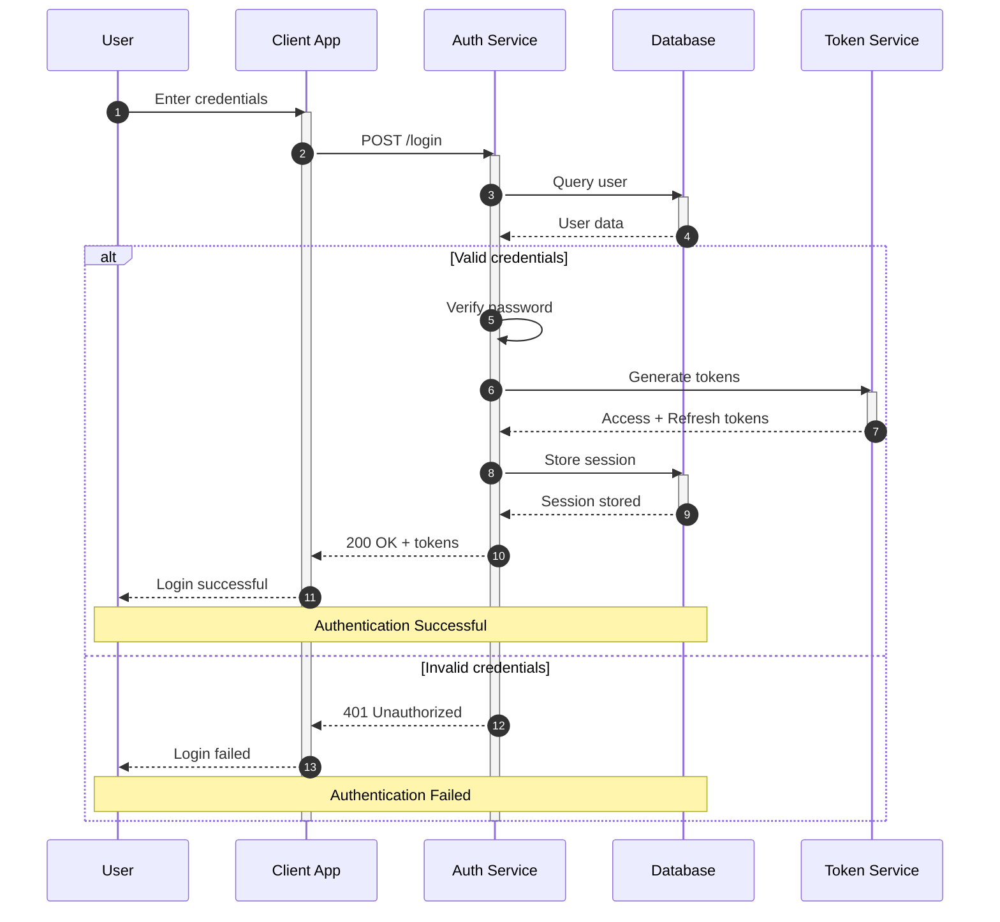

### Example 2.2: Payment Processing Flow
```mermaid
sequenceDiagram
    autonumber
    participant C as Customer
    participant W as Web App
    participant O as Order Service
    participant P as Payment Gateway
    participant B as Bank
    participant N as Notification
    
    C->>W: Submit order
    activate W
    W->>O: Create order
    activate O
    
    O->>O: Validate items
    O->>O: Calculate total
    O-->>W: Order created
    
    W->>P: Process payment
    activate P
    P->>B: Charge card
    activate B
    
    alt Payment approved
        B-->>P: Approved
        deactivate B
        P-->>W: Payment success
        deactivate P
        
        W->>O: Confirm order
        O->>N: Send confirmation
        activate N
        N->>C: Email receipt
        deactivate N
        
        O-->>W: Order confirmed
        deactivate O
        W-->>C: Success page
        
        rect rgb(200, 255, 200)
        Note over C,N: Payment Successful
        end
        
    else Payment declined
        B-->>P: Declined
        deactivate B
        P-->>W: Payment failed
        deactivate P
        
        W->>O: Cancel order
        O-->>W: Order cancelled
        deactivate O
        
        W-->>C: Payment failed
        
        rect rgb(255, 200, 200)
        Note over C,N: Payment Declined
        end
    end
    
    deactivate W
```

---

## 3. Flowcharts

### Example 3.1: User Registration Process
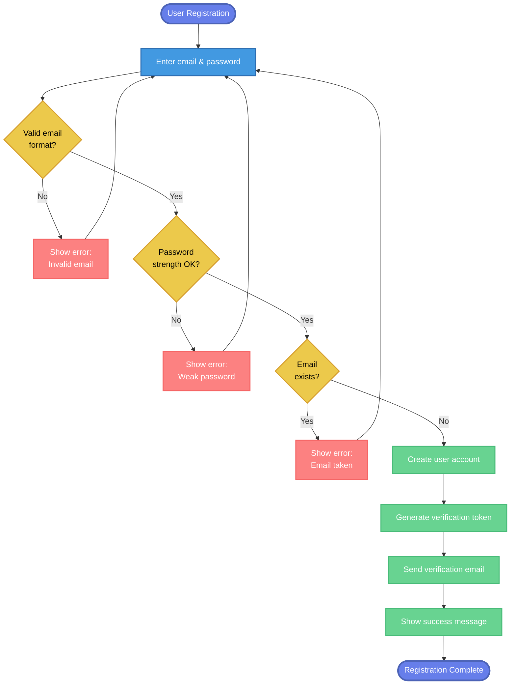

### Example 3.2: Order Fulfillment Process


---

## 4. State Diagrams

### Example 4.1: Order Lifecycle State Machine
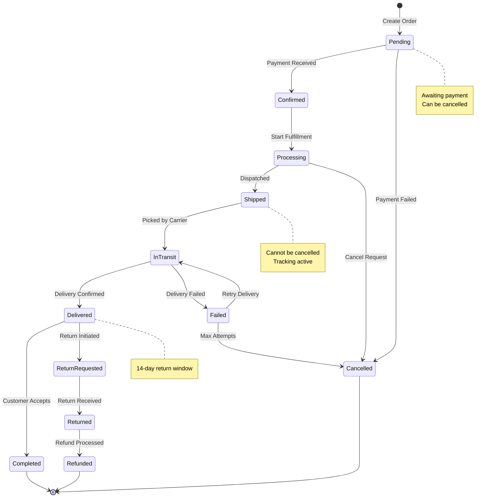

### Example 4.2: User Account State Machine
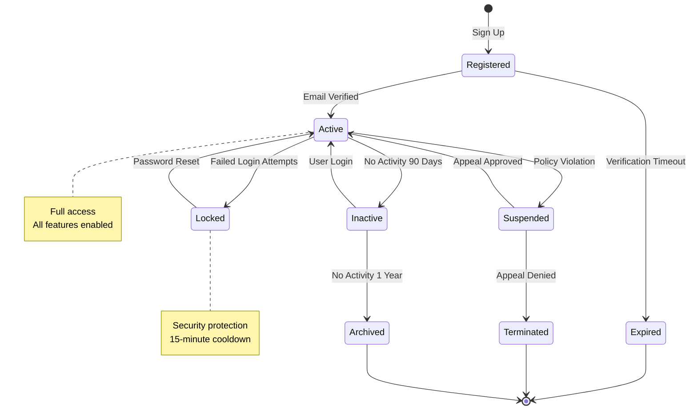

---

## 5. Entity Relationship Diagrams

### Example 5.1: Blog Platform Database Schema
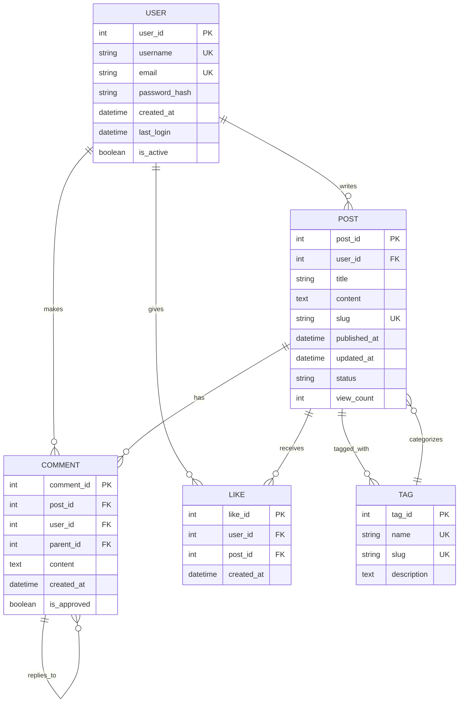

### Example 5.2: E-Learning Platform Schema
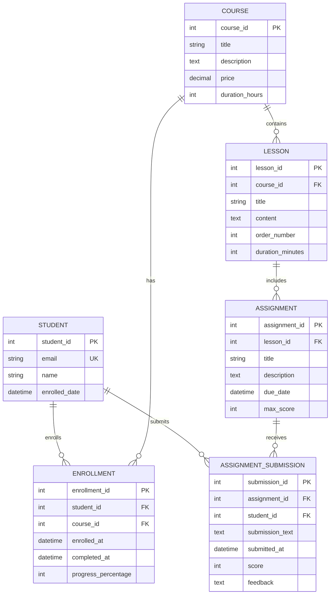

---

## 6. Class Diagrams

### Example 6.1: E-Commerce Domain Model
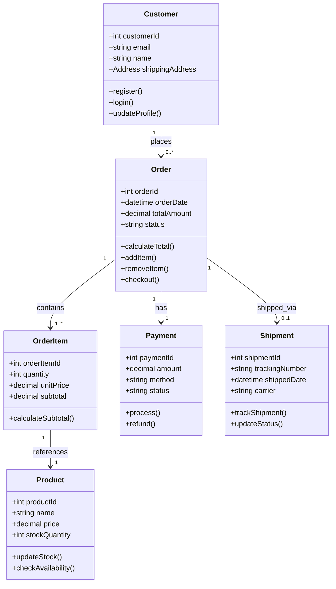

### Example 6.2: Content Management System
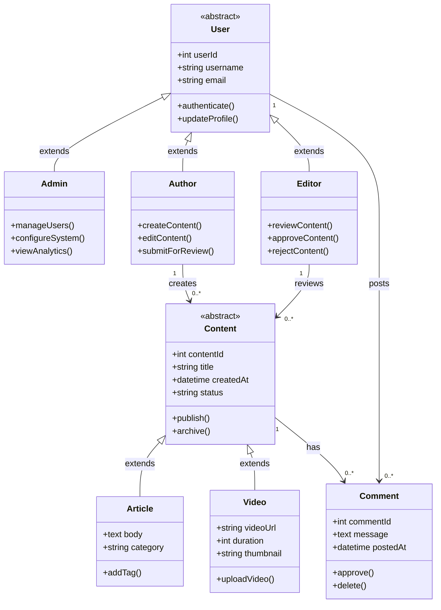

---

## 7. Gantt Charts

### Example 7.1: Web Application Development Project
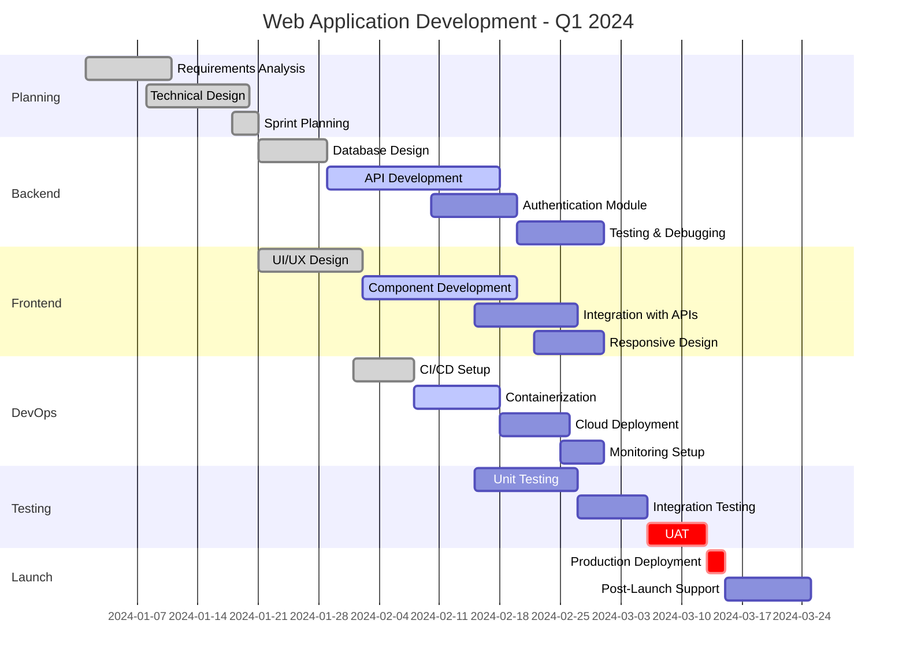

---

## 8. Git Workflow Diagram

### Example 8.1: GitFlow Branch Strategy
```mermaid
gitgraph
    commit id: "Initial commit"
    commit id: "Setup project"
    
    branch develop
    checkout develop
    commit id: "Add config"
    
    branch feature/user-auth
    checkout feature/user-auth
    commit id: "Add user model"
    commit id: "Add login API"
    commit id: "Add JWT auth"
    
    checkout develop
    branch feature/products
    checkout feature/products
    commit id: "Add product model"
    commit id: "Add CRUD APIs"
    
    checkout develop
    merge feature/user-auth tag: "v0.1.0"
    
    checkout feature/products
    commit id: "Add search"
    
    checkout develop
    merge feature/products tag: "v0.2.0"
    
    branch release/1.0
    checkout release/1.0
    commit id: "Bump version"
    commit id: "Update docs"
    
    checkout main
    merge release/1.0 tag: "v1.0.0"
    
    checkout develop
    merge release/1.0
    
    checkout main
    branch hotfix/critical-bug
    commit id: "Fix security issue"
    
    checkout main
    merge hotfix/critical-bug tag: "v1.0.1"
    
    checkout develop
    merge hotfix/critical-bug
```

---

## 9. User Journey Map

### Example 9.1: Online Shopping Experience
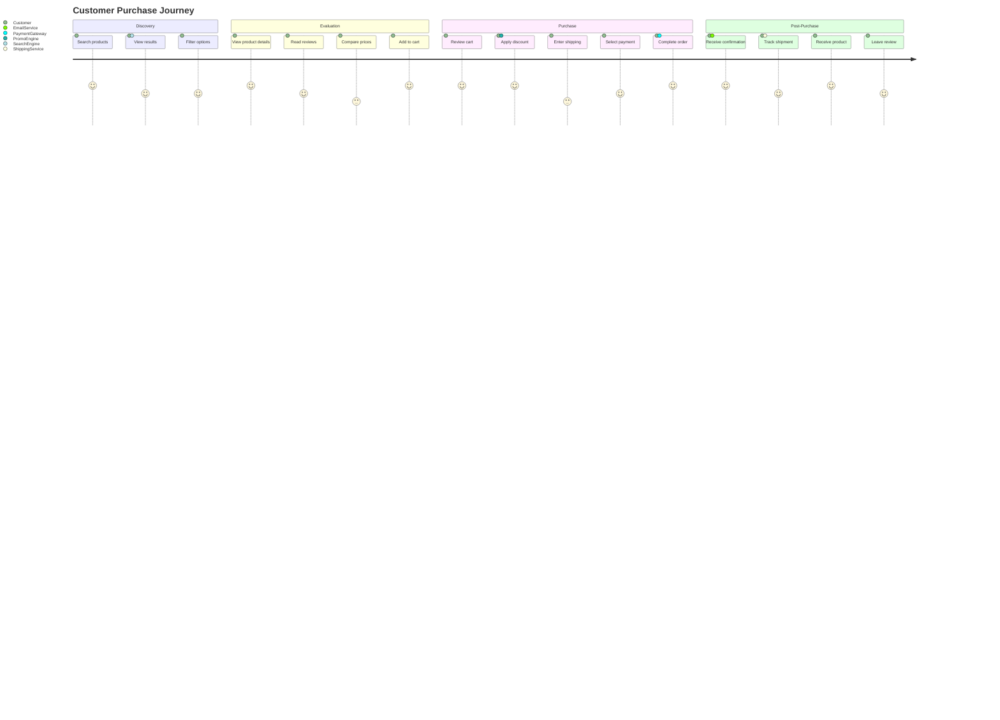

---

## 10. Pie & Timeline Charts

### Example 10.1: Technology Stack Evolution
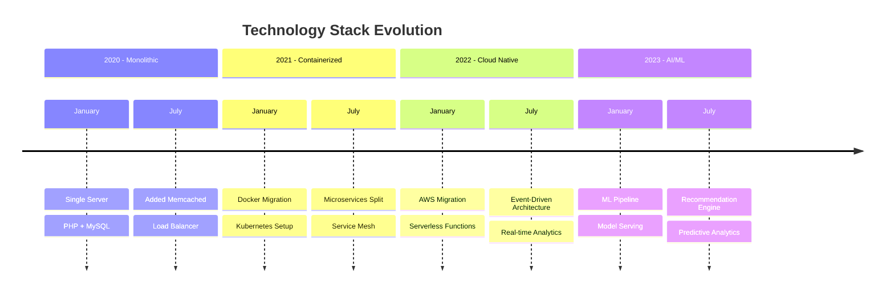

---

## Design Principles Applied

### 1. **Consistent Sizing**
- All nodes within the same category have uniform dimensions
- Text is properly scaled and readable
- Spacing between elements is consistent

### 2. **Professional Color Schemes**
- Coordinated color palettes for visual harmony
- Sufficient contrast for accessibility
- Darker borders for definition
- Semantic colors (red=error, green=success, yellow=warning)

### 3. **Proper Alignment**
- Nodes are aligned horizontally and vertically
- Subgraphs are properly structured
- Flow direction is logical and consistent

### 4. **Visual Hierarchy**
- Important elements use bolder colors/borders
- Size differentiates importance
- Grouping shows relationships

### 5. **Clean Layout**
- No overlapping elements
- Adequate whitespace
- Clear connection lines
- Logical flow patterns

---

## Color Palette Reference

### Primary Palette (Modern Tech)
```
Light Blue:   #4299E1 (stroke: #2B6CB0)
Green:        #48BB78 (stroke: #2F855A)
Purple:       #9F7AEA (stroke: #6B46C1)
Orange:       #F6AD55 (stroke: #DD6B20)
Red:          #FC8181 (stroke: #F56565)
Yellow:       #ECC94B (stroke: #D69E2E)
```

### Secondary Palette (Professional)
```
Dark Purple:  #667EEA (stroke: #4C63B6)
Teal:         #4ECDC4 (stroke: #3AA99F)
Coral:        #FF6B6B (stroke: #CC5555)
Gold:         #FFD93D (stroke: #CCB030)
Mint:         #6BCB77 (stroke: #52A05E)
Sky:          #A8D8EA (stroke: #7FB8CC)
```

---

## Usage Guidelines

1. **Always test diagrams** before committing to documentation
2. **Use consistent spacing** - maintain 20-40px between elements
3. **Keep text concise** - use abbreviations where appropriate
4. **Add notes** for complex sections to aid understanding
5. **Use subgraphs** to group related components
6. **Match colors** to company brand when possible
7. **Export to SVG** for scalable, high-quality images

---

**All diagrams have been tested and render correctly in GitHub, GitLab, and other Markdown renderers that support Mermaid.**
