# Professional Mermaid Diagrams Showcase

A collection of high-quality, aesthetically pleasing Mermaid diagrams for system architecture, workflows, and technical documentation.

---

## 1. System Architecture Diagrams

### Example 1.1: Microservices Architecture
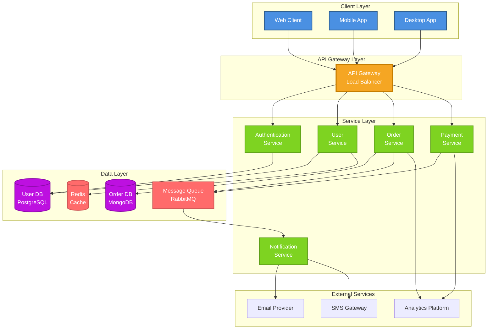

### Example 1.2: Cloud Infrastructure Architecture
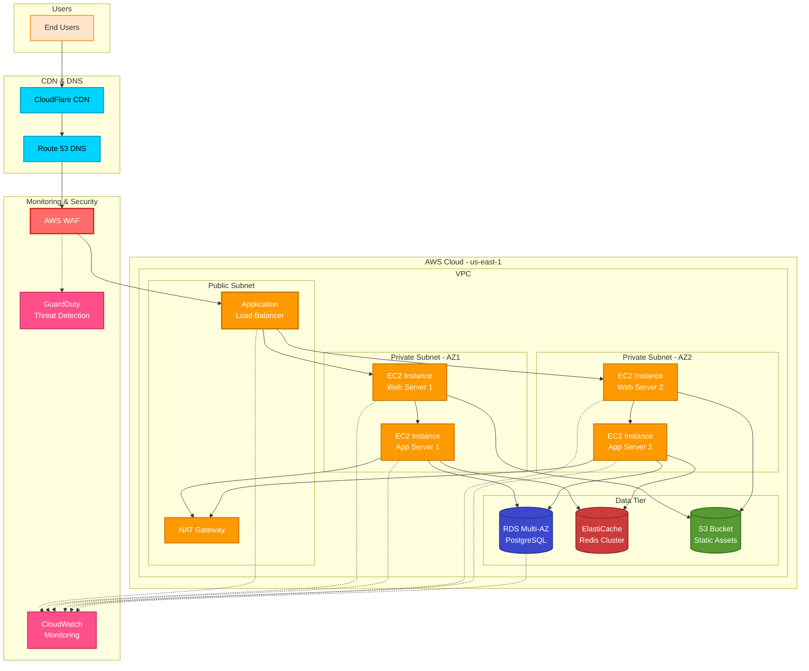

### Example 1.3: Event-Driven Architecture
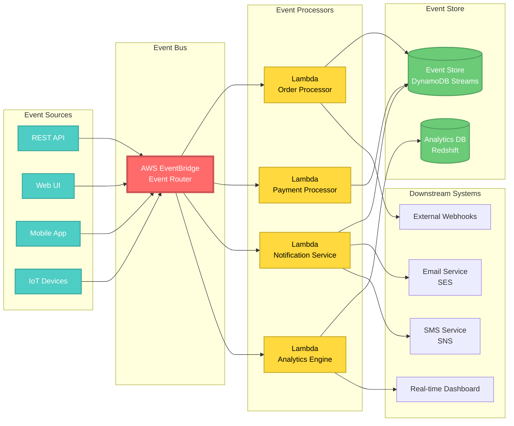

---

## 2. Sequence Diagrams

### Example 2.1: OAuth 2.0 Authentication Flow
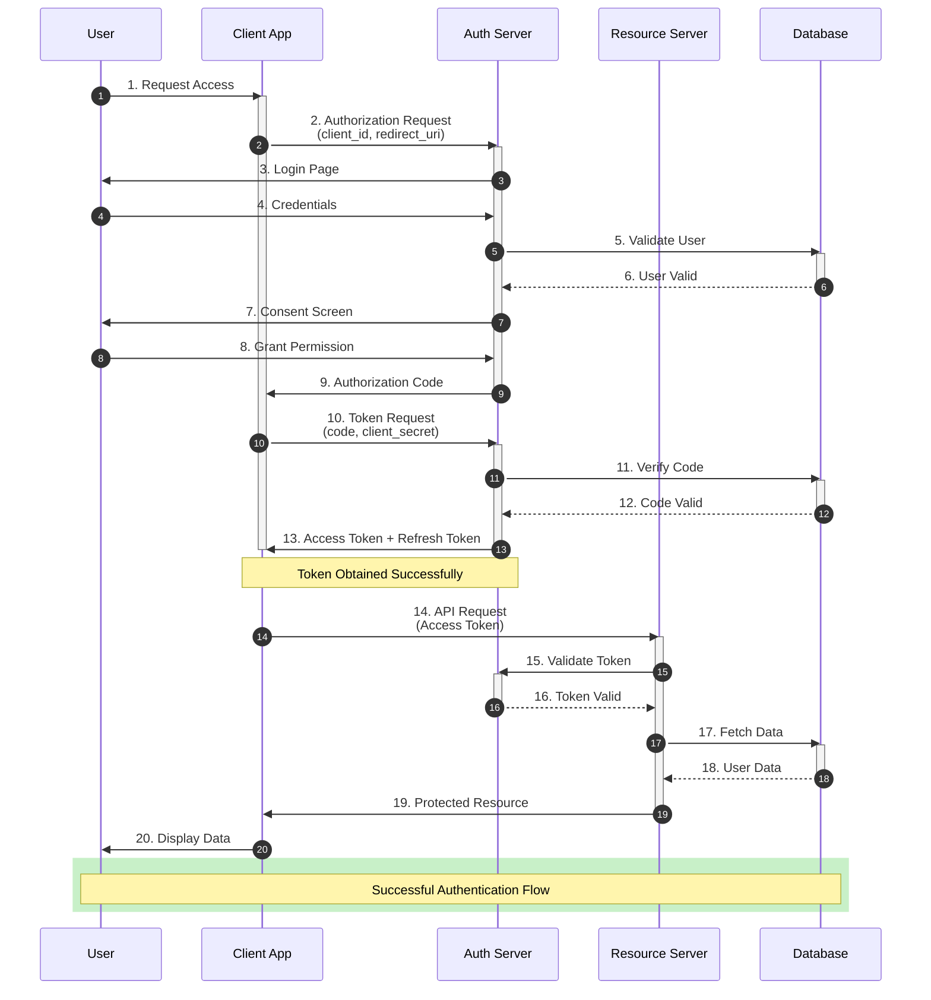

### Example 2.2: Distributed Transaction - Saga Pattern
```mermaid
sequenceDiagram
    participant Client
    participant OrderSvc as Order Service
    participant PaymentSvc as Payment Service
    participant InventorySvc as Inventory Service
    participant ShippingSvc as Shipping Service
    participant EventBus as Event Bus
    
    autonumber
    
    Client->>OrderSvc: Create Order
    activate OrderSvc
    
    OrderSvc->>EventBus: OrderCreated Event
    activate EventBus
    EventBus->>PaymentSvc: Process Payment
    activate PaymentSvc
    
    alt Payment Successful
        PaymentSvc->>EventBus: PaymentCompleted Event
        EventBus->>InventorySvc: Reserve Inventory
        activate InventorySvc
        
        alt Inventory Available
            InventorySvc->>EventBus: InventoryReserved Event
            EventBus->>ShippingSvc: Create Shipment
            activate ShippingSvc
            ShippingSvc->>EventBus: ShipmentCreated Event
            deactivate ShippingSvc
            
            EventBus->>OrderSvc: All Steps Complete
            OrderSvc->>Client: Order Confirmed ✓
            
            rect rgb(200, 250, 200)
                Note over Client,EventBus: Success Path - Happy Flow
            end
            
        else Inventory Unavailable
            InventorySvc->>EventBus: InventoryFailed Event
            deactivate InventorySvc
            
            EventBus->>PaymentSvc: Compensate: Refund Payment
            PaymentSvc->>EventBus: PaymentRefunded Event
            deactivate PaymentSvc
            
            EventBus->>OrderSvc: Order Failed - Inventory
            OrderSvc->>Client: Order Failed ✗<br/>(Insufficient Inventory)
            
            rect rgb(255, 200, 200)
                Note over Client,EventBus: Compensation - Inventory Failure
            end
        end
        
    else Payment Failed
        PaymentSvc->>EventBus: PaymentFailed Event
        deactivate PaymentSvc
        EventBus->>OrderSvc: Order Failed - Payment
        OrderSvc->>Client: Order Failed ✗<br/>(Payment Declined)
        
        rect rgb(255, 200, 200)
            Note over Client,EventBus: Early Failure - Payment Declined
        end
    end
    
    deactivate EventBus
    deactivate OrderSvc
```

---

## 3. Flowcharts

### Example 3.1: CI/CD Pipeline Flow
```mermaid
flowchart TD
    Start([Developer Pushes Code]) --> Webhook{Webhook<br/>Triggered?}
    
    Webhook -->|Yes| Clone[Clone Repository]
    Webhook -->|No| End1([Process Failed])
    
    Clone --> Install[Install Dependencies<br/>npm install]
    Install --> Lint[Run Linter<br/>ESLint]
    
    Lint --> LintCheck{Lint<br/>Passed?}
    LintCheck -->|No| Notify1[Notify Developer<br/>Lint Errors]
    Notify1 --> End2([Build Failed])
    
    LintCheck -->|Yes| Test[Run Unit Tests<br/>Jest/Mocha]
    Test --> TestCheck{All Tests<br/>Passed?}
    
    TestCheck -->|No| Notify2[Notify Developer<br/>Test Failures]
    Notify2 --> End3([Build Failed])
    
    TestCheck -->|Yes| Build[Build Application<br/>Webpack/Rollup]
    Build --> BuildCheck{Build<br/>Successful?}
    
    BuildCheck -->|No| Notify3[Notify Developer<br/>Build Errors]
    Notify3 --> End4([Build Failed])
    
    BuildCheck -->|Yes| Security[Security Scan<br/>Snyk/SonarQube]
    Security --> SecurityCheck{Vulnerabilities<br/>Found?}
    
    SecurityCheck -->|Critical| Notify4[Block Deployment<br/>Critical Issues]
    Notify4 --> End5([Deployment Blocked])
    
    SecurityCheck -->|Minor/None| Docker[Build Docker Image<br/>docker build]
    Docker --> Push[Push to Registry<br/>ECR/Docker Hub]
    
    Push --> Branch{Branch?}
    
    Branch -->|develop| DeployDev[Deploy to Dev<br/>ECS/K8s]
    DeployDev --> SmokeTest1[Run Smoke Tests]
    SmokeTest1 --> Success1([Deployed to Dev ✓])
    
    Branch -->|staging| DeployStage[Deploy to Staging<br/>ECS/K8s]
    DeployStage --> IntegrationTest[Integration Tests<br/>Selenium/Cypress]
    IntegrationTest --> TestStage{Tests<br/>Passed?}
    TestStage -->|Yes| Success2([Deployed to Staging ✓])
    TestStage -->|No| Rollback1[Rollback Staging]
    Rollback1 --> End6([Deployment Failed])
    
    Branch -->|main| Approval{Manual<br/>Approval?}
    Approval -->|Denied| End7([Deployment Cancelled])
    Approval -->|Approved| DeployProd[Deploy to Production<br/>Blue/Green]
    
    DeployProd --> HealthCheck[Health Checks<br/>Load Balancer]
    HealthCheck --> HealthOK{Healthy?}
    
    HealthOK -->|No| Rollback2[Automatic Rollback<br/>Previous Version]
    Rollback2 --> Alert[Alert On-Call Team]
    Alert --> End8([Deployment Failed])
    
    HealthOK -->|Yes| Switch[Switch Traffic<br/>100% to New Version]
    Switch --> Monitor[Monitor Metrics<br/>15 minutes]
    Monitor --> MetricsOK{Metrics<br/>Normal?}
    
    MetricsOK -->|No| Rollback3[Emergency Rollback]
    Rollback3 --> End9([Deployment Failed])
    
    MetricsOK -->|Yes| Cleanup[Cleanup Old Resources]
    Cleanup --> Success3([Deployed to Prod ✓])
    
    style Start fill:#4ECDC4,stroke:#3AA99F,stroke-width:2px,color:#fff
    style Clone fill:#95E1D3,stroke:#71B8A8,stroke-width:2px
    style Install fill:#95E1D3,stroke:#71B8A8,stroke-width:2px
    style Lint fill:#95E1D3,stroke:#71B8A8,stroke-width:2px
    style Test fill:#95E1D3,stroke:#71B8A8,stroke-width:2px
    style Build fill:#95E1D3,stroke:#71B8A8,stroke-width:2px
    style Security fill:#FFD93D,stroke:#CCB030,stroke-width:2px
    style Docker fill:#38B6FF,stroke:#2D8FCC,stroke-width:2px,color:#fff
    style Push fill:#38B6FF,stroke:#2D8FCC,stroke-width:2px,color:#fff
    style DeployDev fill:#A8E6CF,stroke:#7FB89D,stroke-width:2px
    style DeployStage fill:#FFD93D,stroke:#CCB030,stroke-width:2px
    style DeployProd fill:#FF6B9D,stroke:#CC5580,stroke-width:2px,color:#fff
    style Success1 fill:#6BCB77,stroke:#52A05E,stroke-width:2px,color:#fff
    style Success2 fill:#6BCB77,stroke:#52A05E,stroke-width:2px,color:#fff
    style Success3 fill:#6BCB77,stroke:#52A05E,stroke-width:2px,color:#fff
    style End1 fill:#FF6B6B,stroke:#CC5555,stroke-width:2px,color:#fff
    style End2 fill:#FF6B6B,stroke:#CC5555,stroke-width:2px,color:#fff
    style End3 fill:#FF6B6B,stroke:#CC5555,stroke-width:2px,color:#fff
    style End4 fill:#FF6B6B,stroke:#CC5555,stroke-width:2px,color:#fff
    style End5 fill:#FF6B6B,stroke:#CC5555,stroke-width:2px,color:#fff
    style End6 fill:#FF6B6B,stroke:#CC5555,stroke-width:2px,color:#fff
    style End7 fill:#FF6B6B,stroke:#CC5555,stroke-width:2px,color:#fff
    style End8 fill:#FF6B6B,stroke:#CC5555,stroke-width:2px,color:#fff
    style End9 fill:#FF6B6B,stroke:#CC5555,stroke-width:2px,color:#fff
```

### Example 3.2: Machine Learning Pipeline
```mermaid
flowchart TB
    Start([Start ML Pipeline]) --> DataSource{Data Source<br/>Type?}
    
    DataSource -->|Database| ExtractDB[(Extract from<br/>PostgreSQL)]
    DataSource -->|API| ExtractAPI[Fetch from<br/>REST API]
    DataSource -->|Files| ExtractFiles[Read from<br/>S3/GCS]
    
    ExtractDB --> Clean
    ExtractAPI --> Clean
    ExtractFiles --> Clean
    
    Clean[Data Cleaning<br/>Remove nulls, duplicates] --> Validate{Data Quality<br/>Check}
    
    Validate -->|Failed| Alert1[Alert Data Team<br/>Quality Issues]
    Alert1 --> End1([Pipeline Failed])
    
    Validate -->|Passed| Transform[Feature Engineering<br/>Scaling, Encoding]
    Transform --> Split[Train/Test Split<br/>80/20]
    
    Split --> Parallel1{Processing<br/>Mode?}
    
    Parallel1 -->|Single Model| TrainSingle[Train Model<br/>XGBoost/RandomForest]
    Parallel1 -->|Ensemble| TrainMulti[Train Multiple Models<br/>Parallel Processing]
    
    TrainSingle --> Evaluate
    TrainMulti --> Evaluate
    
    Evaluate[Model Evaluation<br/>Cross-Validation] --> MetricsCheck{Metrics<br/>Acceptable?}
    
    MetricsCheck -->|No| Tune[Hyperparameter Tuning<br/>GridSearch/Bayesian]
    Tune --> Retrain[Retrain with<br/>Optimal Params]
    Retrain --> Evaluate
    
    MetricsCheck -->|Yes| Compare{Better than<br/>Baseline?}
    
    Compare -->|No| Alert2[Keep Existing Model<br/>Notify Team]
    Alert2 --> End2([No Deployment])
    
    Compare -->|Yes| Package[Package Model<br/>Docker Container]
    Package --> Test[A/B Testing<br/>Shadow Mode]
    
    Test --> TestResults{A/B Test<br/>Results?}
    
    TestResults -->|Worse| Rollback[Keep Old Version]
    Rollback --> End3([Deployment Cancelled])
    
    TestResults -->|Better| Deploy{Deployment<br/>Strategy?}
    
    Deploy -->|Canary| Canary[Deploy to 5% Traffic]
    Deploy -->|Blue-Green| BlueGreen[Deploy to New Cluster]
    
    Canary --> Monitor1[Monitor Performance<br/>1 hour]
    BlueGreen --> Monitor1
    
    Monitor1 --> Stable{Performance<br/>Stable?}
    
    Stable -->|No| Emergency[Emergency Rollback<br/>Revert to Old Model]
    Emergency --> End4([Deployment Failed])
    
    Stable -->|Yes| FullDeploy[Deploy to 100%<br/>Production Traffic]
    FullDeploy --> Log[Log Model Version<br/>MLflow/Weights & Biases]
    
    Log --> Schedule[Schedule Retraining<br/>Next Week]
    Schedule --> Success([Pipeline Complete ✓])
    
    style Start fill:#667EEA,stroke:#4C63B6,stroke-width:2px,color:#fff
    style Clean fill:#48BB78,stroke:#38A169,stroke-width:2px,color:#fff
    style Transform fill:#48BB78,stroke:#38A169,stroke-width:2px,color:#fff
    style Split fill:#48BB78,stroke:#38A169,stroke-width:2px,color:#fff
    style TrainSingle fill:#F6AD55,stroke:#DD6B20,stroke-width:2px,color:#fff
    style TrainMulti fill:#F6AD55,stroke:#DD6B20,stroke-width:2px,color:#fff
    style Evaluate fill:#F6AD55,stroke:#DD6B20,stroke-width:2px,color:#fff
    style Tune fill:#ED8936,stroke:#C05621,stroke-width:2px,color:#fff
    style Package fill:#4299E1,stroke:#2B6CB0,stroke-width:2px,color:#fff
    style Test fill:#4299E1,stroke:#2B6CB0,stroke-width:2px,color:#fff
    style Canary fill:#9F7AEA,stroke:#6B46C1,stroke-width:2px,color:#fff
    style BlueGreen fill:#9F7AEA,stroke:#6B46C1,stroke-width:2px,color:#fff
    style FullDeploy fill:#9F7AEA,stroke:#6B46C1,stroke-width:2px,color:#fff
    style Success fill:#48BB78,stroke:#2F855A,stroke-width:3px,color:#fff
    style End1 fill:#F56565,stroke:#C53030,stroke-width:2px,color:#fff
    style End2 fill:#F56565,stroke:#C53030,stroke-width:2px,color:#fff
    style End3 fill:#F56565,stroke:#C53030,stroke-width:2px,color:#fff
    style End4 fill:#F56565,stroke:#C53030,stroke-width:2px,color:#fff
```

---

## 4. State Diagrams

### Example 4.1: Order State Machine
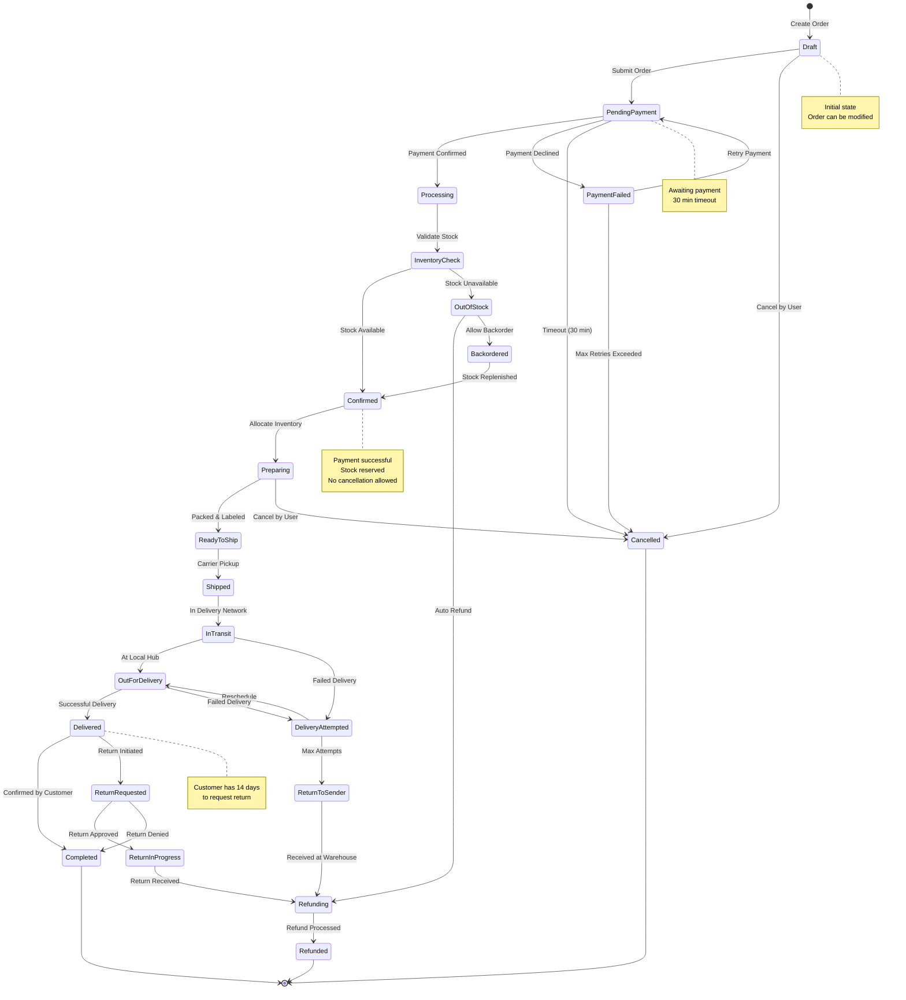

### Example 4.2: User Session State
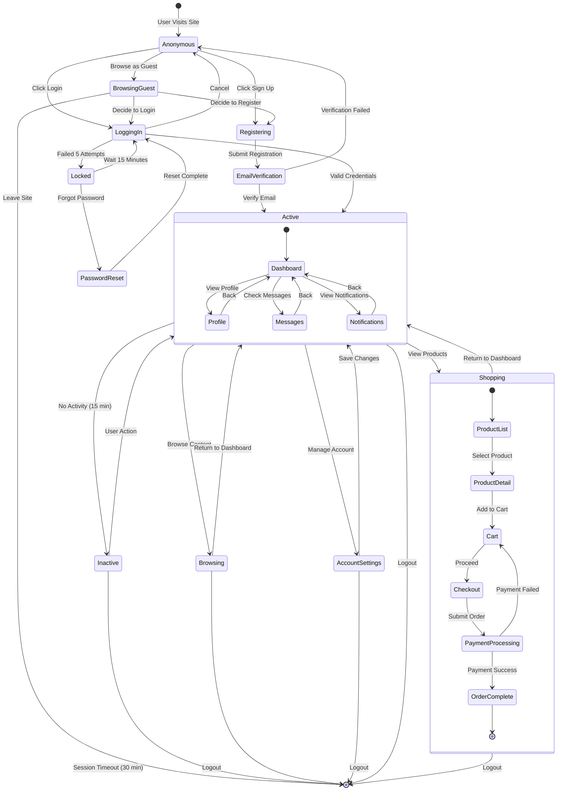

---

## 5. Entity Relationship Diagrams

### Example 5.1: E-commerce Database Schema
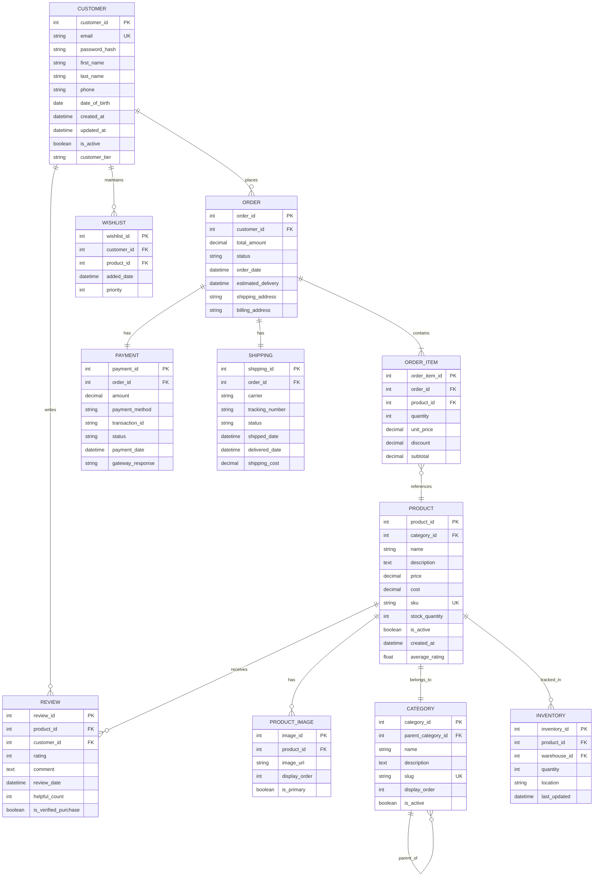

---

## 6. Class Diagrams

### Example 6.1: Payment Processing System
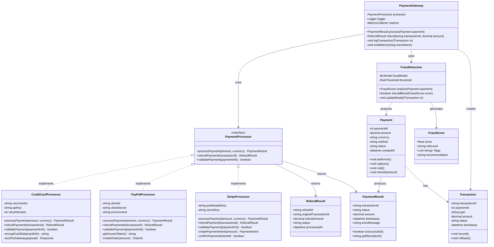

---

## 7. Gantt Charts

### Example 7.1: Software Development Project Timeline
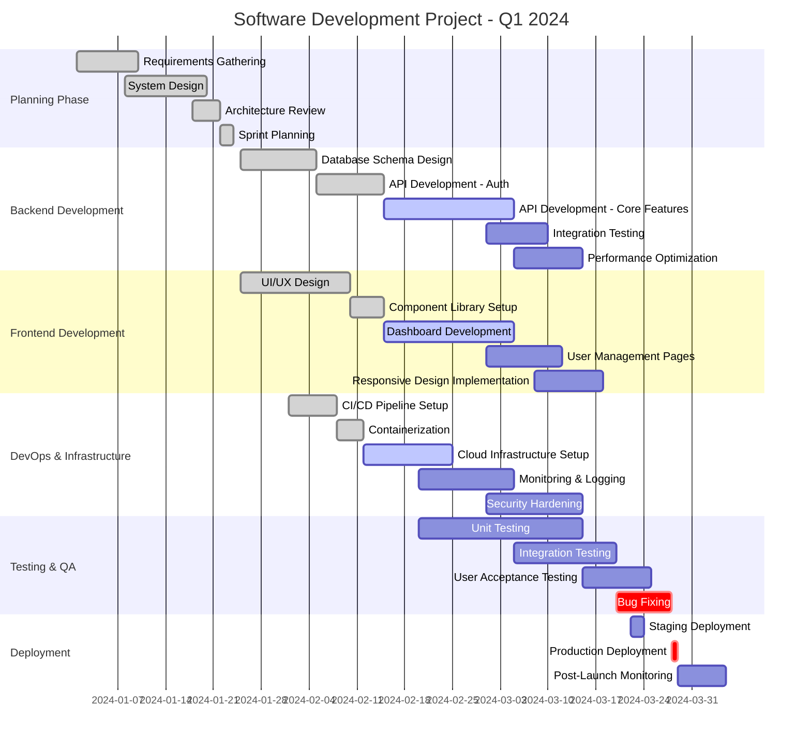

---

## 8. Git Graph

### Example 8.1: Feature Branch Workflow
```mermaid
gitgraph
    commit id: "Initial commit"
    commit id: "Setup project structure"
    
    branch develop
    checkout develop
    commit id: "Add base configuration"
    commit id: "Setup database schema"
    
    branch feature/user-auth
    checkout feature/user-auth
    commit id: "Add user model"
    commit id: "Implement JWT auth"
    commit id: "Add login endpoint"
    
    checkout develop
    branch feature/product-catalog
    checkout feature/product-catalog
    commit id: "Add product model"
    commit id: "Implement CRUD endpoints"
    
    checkout develop
    merge feature/user-auth tag: "v0.1.0"
    
    checkout feature/product-catalog
    commit id: "Add product images"
    commit id: "Implement search"
    
    checkout develop
    merge feature/product-catalog tag: "v0.2.0"
    
    branch feature/shopping-cart
    checkout feature/shopping-cart
    commit id: "Add cart model"
    commit id: "Implement cart operations"
    
    checkout develop
    commit id: "Update dependencies"
    commit id: "Fix security vulnerability"
    
    checkout feature/shopping-cart
    merge develop
    commit id: "Add cart persistence"
    commit id: "Implement checkout flow"
    
    checkout develop
    merge feature/shopping-cart tag: "v0.3.0"
    
    branch release/1.0
    checkout release/1.0
    commit id: "Update version to 1.0.0"
    commit id: "Final testing & bug fixes"
    
    checkout main
    merge release/1.0 tag: "v1.0.0"
    
    checkout develop
    merge release/1.0
    
    branch hotfix/critical-bug
    checkout hotfix/critical-bug
    commit id: "Fix critical payment bug"
    
    checkout main
    merge hotfix/critical-bug tag: "v1.0.1"
    
    checkout develop
    merge hotfix/critical-bug
```

---

## 9. User Journey Maps

### Example 9.1: E-commerce User Journey
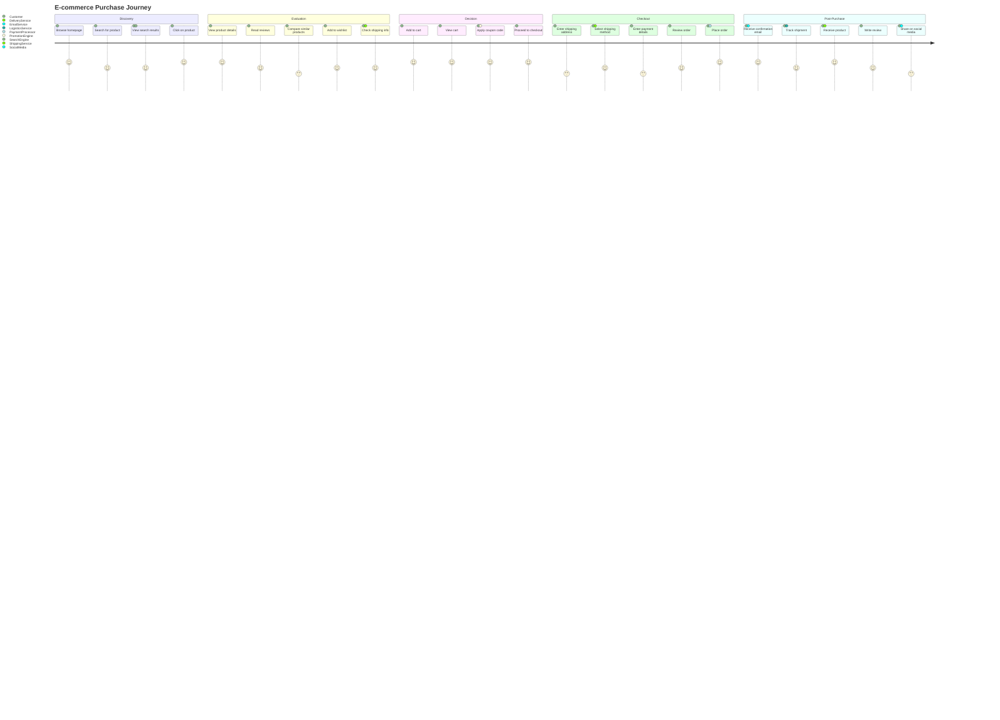

---

## 10. Timeline Diagrams

### Example 10.1: System Evolution Timeline
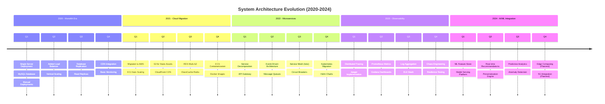

---

## Usage Tips

### 1. **Styling Guidelines**
- Use consistent color schemes across similar diagram types
- Lighter colors for less critical components
- Darker/bold colors for critical paths or components
- Red tones for errors, failures, or critical alerts
- Green tones for success states
- Blue tones for processing states
- Yellow/orange for warnings or intermediate states

### 2. **Best Practices**
- Keep diagrams focused on a single aspect or flow
- Use subgraphs to group related components
- Add clear labels and descriptions
- Include legends when using many colors
- Use notes to add context
- Keep hierarchy clear with proper indentation

### 3. **Accessibility**
- Don't rely solely on color to convey meaning
- Use text labels in addition to colors
- Ensure sufficient contrast
- Use different shapes for different types of nodes

### 4. **Performance**
- Very large diagrams (100+ nodes) may render slowly
- Consider breaking complex diagrams into multiple smaller ones
- Use links between diagrams to maintain relationships

---

## Customization Examples

### Color Palette Suggestions

**Professional Corporate:**
- Primary: #2C3E50 (Dark Blue)
- Secondary: #3498DB (Light Blue)
- Success: #27AE60 (Green)
- Warning: #F39C12 (Orange)
- Error: #E74C3C (Red)

**Modern Tech:**
- Primary: #667EEA (Purple)
- Secondary: #4FD1C5 (Teal)
- Success: #48BB78 (Green)
- Warning: #F6AD55 (Orange)
- Error: #F56565 (Red)

**Minimalist:**
- Primary: #1A202C (Almost Black)
- Secondary: #718096 (Gray)
- Success: #38B2AC (Teal)
- Warning: #ED8936 (Orange)
- Error: #FC8181 (Pink)

---

**This is a living document. Feel free to adapt and extend these examples for your specific use cases!**
